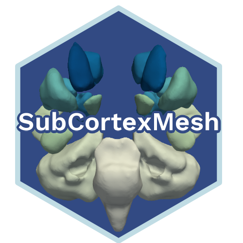
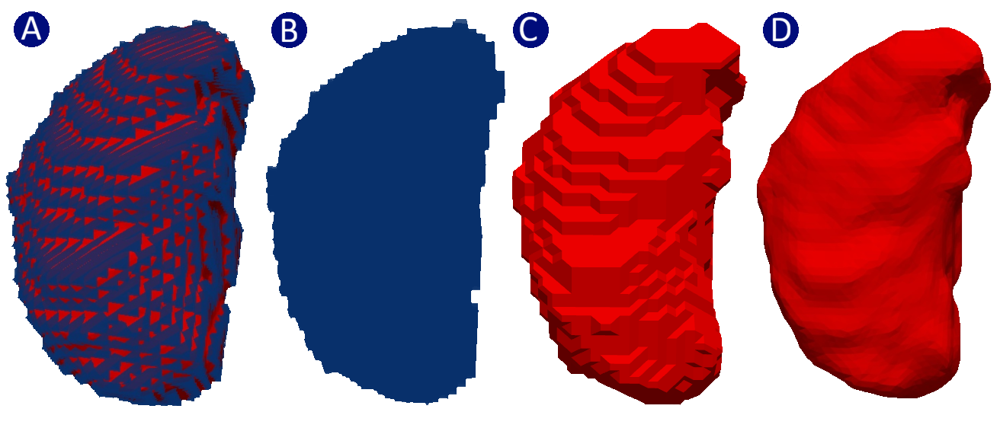
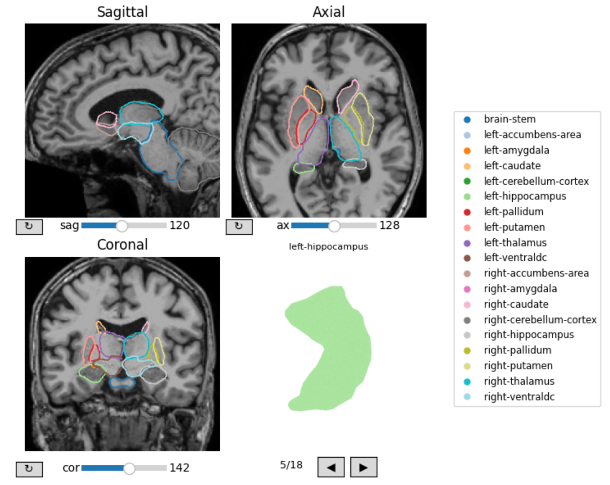
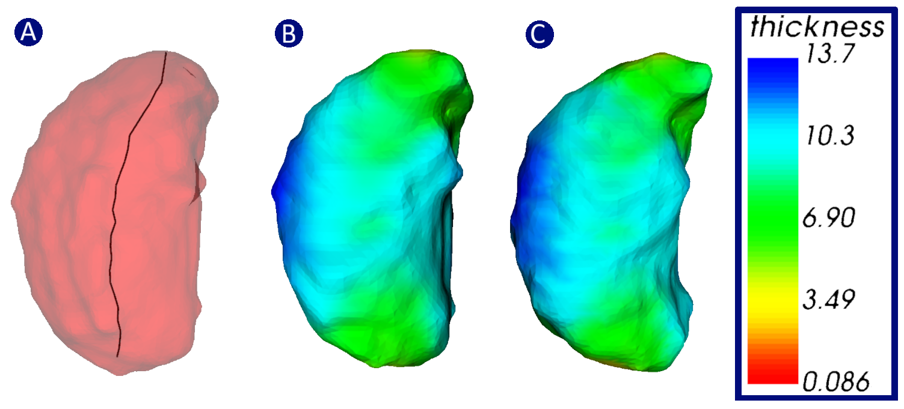
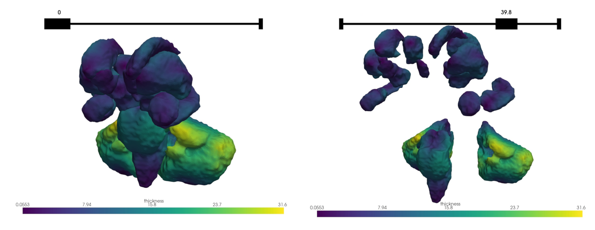

# SubCortexMesh

## Surface-based postprocessing of segmented subcortices in Python

This toolbox provides commands for surface based measures of subcortical segmentations from FreeSurfer and FSL FIRST, including thickness, surface area and curvature. Depending on the segmentation algorithm, compatible subcortices are: the left and right **Thalamus**, **Caudate**, **Putamen**, **Pallidum**, **Hippocampus**, **Amygdala**, **Accumbens-area**, **Ventral diencephalon**, **Cerebellum-Cortex**, and the **Brain-Stem**.

## Workflow

For FreeSurfer, the toolbox automatically converts a subjects directory's subcortical volumes to 3D surface meshes, using the ASeg (automatic subcortical segmentation) outputted by default in the [recon-all pipeline](https://surfer.nmr.mgh.harvard.edu/fswiki/recon-all). SubCortexMesh:

-   Rigidly coregisters subject-space ASeg volumes (*aseg.mgz*) to fsaverage space (MNI305). It solely does rotation and no interpolation to preserve subject-space dimensions.

-   Extracts individual regions-of-interest (ROIs) as separate volumes

-   Converts each volume to surface meshes using VTK's Discrete Marching Cube protocol, with additional dilating+eroding and smoothing to minimise artefacts (can be disabled or lowered)

For FSL FIRST, the toolbox copies the subjects' surface meshes outputted via the [first_run_all command](https://fsl.fmrib.ox.ac.uk/fsl/docs/structural/first.html#segmentation-with-run_first_all) and renames them into a standard file tree.

When surface files are gathered, SubCortexMesh:

-   Measures vertex-wise thickness (radial distance from a generated medial curve), surface area (1/3 of the area of the triangles a vertex is part of) and curvature (mean curvature).

-   Saves descriptive statistics for each ROI in a table for each subject and metric.

-   Aligns subject meshes and projects their vertex-wise values to a standard template-based surface, based on fsaverage for FreeSurfer outputs,[^readme-1] and MNI152 for FSL FIRST outputs[^readme-2]. The native space meshes, with their associated scalar metrics, can also be saved.

[^readme-1]: The fsaverage/MNI305 surface-based templates for each ROI have been produced by using SubCortexMesh's own functions (aseg_getvol(), vol2surf()) with default parameters, on the fsaverage template's own aseg.mgz in FreeSurfer 7.4.1 (\$FREESURFER_HOME/subjects/fsaverage/mri/aseg.mgz).

[^readme-2]: The fslfirst/MNI152 surface-based templates for each ROI have been produced by using FSL v.6.0.6's own probabilistic models (.bmv files in \$FSLDIR/data/first/models_336_bin/) on the standard MNI 152 1mm T1w volume (\$FSLDIR/data/standard/MNI152_T1_1mm_brain.nii.gz). Cerebellar meshes were produced using [run_first](https://fsl.fmrib.ox.ac.uk/fsl/docs/structural/first.html#advanced-usage), with "-n 40" modes, using the putamen intensities to normalise its intensity sample as recommended by the latter's documentation.

## Installation

SubCortexMesh can be installed via pip from the GitHub directory:

``` bash
pip install git+https://github.com/chabld/SubCortexMesh.git
```

For the ASeg volume coregistration and extraction, SubCortexMesh requires [FreeSurfer](https://surfer.nmr.mgh.harvard.edu/fswiki/FreeSurferWiki) to be installed and accessible to the environment python the toolbox is loaded in (which means it must be able to run FreeSurfer commands via os.system()). Subsequent computations (conversion of volumes to surface meshes, computation of surface-based metrics, and standardization) are fully executed in Python, mainly relying on the [VTK](https://vtk.org/) *v*9.5.2 module.

Once imported in python, the toolbox requires base template data to be downloaded. The command below is triggered by every function that needs the data. It checks for its existence and if it is not found, it will assist user so they can download it:

``` python
from subcortexmesh import template_data_fetch
toolboxdata=template_data_fetch(template='fsaverage') #or 'fslfirst'
```

## Getting started

### Extracting and converting FreeSurfer subcortical volumes

The registration and extraction of ASeg volumes is done on FreeSurfer output subjects directories (`$SUBJECTS_DIR`) and collates all subjects' individual *aseg.mgz* volumes at once. Unless specified otherwise, the ASeg volumes are generated by default in the [recon-all pipeline](https://surfer.nmr.mgh.harvard.edu/fswiki/recon-all).

This is the command that extracts volumes (the *toolboxdata* argument only needs to be specified if it was not downloaded to the default path, i.e. the user's home directory).

``` python
from subcortexmesh import aseg_getvol
aseg_getvol(
  inputdir="SPRENG_FreeSurfer_subsample/", 
  outputdir="/my_outputdir/",
  #toolboxdata="/user_path/subcortexmesh_data",
  overwrite=False, 
  silent=False)
```

*aseg_getvol()* will create a directory called "sub_volumes" inside the path given (*outputdir*). The path to sub_volumes can then be given to the following command in order to convert the volumes into surfaces:

``` python
from subcortexmesh import vol2surf
vol2surf(
    inputdir="/my_outputdir/sub_volumes",
    outputdir="/my_outputdir/",
    #dilate_erode=True,
    #smoothing=15,
    plot_volnext2surf=True,
    overwrite=False,
    silent=False
    )
```

The *plot_volnext2surf()* argument is False by default, but allows user to check if they are satisfied with the resulting mesh. Below is an example with a left thalamus: A) shows the volume and the surface created from the former superimposed, B) the voxel-based volume, C) the vertex-wise surface (with VTK' [discrete marching cubes](https://vtk.org/doc/nightly/html/classvtkDiscreteMarchingCubes.html) method, no smoothing), D) the surface after dilation+erosion and smoothing.



Similarly, *vol2surf()* will create a directory called "sub_surfaces" inside the given outputdir.

### Visualising converted surfaces meshes

The surfaces stored in "sub_surfaces" can also be plotted together on top of a subject's corresponding volume with the surf_qcplot() function. Because the surfaces are based on a volume rigidly coregistered to fsaverage, the surfaces will match a volume generated with aseg_getvol(), i.e. "sub_volumes/sub-[id]/ants_coreg/T1_fsaverage_rigid_coreg.nii.gz" (or any volume likewise coregistered):

``` python
from subcortexmesh import surf_qcplot
surf_qcplot(
    volpath="/my_outputdir/sub_volumes/sub-[id]/ants_coreg/T1_fsaverage_rigid_coreg.nii.gz",
    surfdir="/my_outputdir/sub_surfaces/sub-[id]",
    vol_color_map= "gray",
    outline_color_map = "tab20"
    )
```



Since regions will have been inflated and smoothed by default to minimise graphical artefacts (e.g. hanging sparse voxels, sharp mesh spikes), the boundaries naturally appear slightly wider than their original anatomy and overlapping (since the surfaces are processed by SubCortexMesh entirely separately, the visual overlap has no effect on later metrics values). In any event, this can be run on surfaces produced with dilate_erode=False.

### Extracting FSL FIRST subcortical meshes

Since FSL FIRST already computes .vtk 3D surface meshes from its own subcortical segmentations, these can be extracted directly from the output directory of the [first_run_all command](https://fsl.fmrib.ox.ac.uk/fsl/docs/structural/first.html#segmentation-with-run_first_all). This function automatically copies and renames all subjects' individual ROI meshes and stores them into a standard "sub_surfaces" directory.

``` python
 fslfirst_getsurf(
    inputdir="/my_outputdir/",
    outputdir="/my_outputdir/subcortexmesh_postproc/",
    overwrite=False,
    silent=False
    )
```

Note that fslfirst_getsurf() follows the sub-xxx convention for participant IDs and will only account for folders that contain such IDs. Optional [cerebellar surfaces](https://fsl.fmrib.ox.ac.uk/fsl/docs/structural/first.html#advanced-usage) also need to be named as the other ROIs produced by first_run_all (*L-Cereb_first.vtk and *R-Cereb_first.vtk).[^readme-3]

[^readme-3]: This can be done with commands such as (do the same for `L_Cereb`): \
    `run_first -i [subject T1file] \ -t [ sub-id_T1w_to_std_sub.mat produced by run_first_all/first_flirt] \ -n 40 \ -o "[subject_directory]/[sub-id]-R_Cereb_first" \ -m "${FSLDIR}/data/first/models_336_bin/intref_puta/R_Cereb.bmv" \
     -intref "${FSLDIR}/data/first/models_336_bin/05mm/R_Puta_05mm.bmv"`

    The putamen used as the intensity reference is what is indicated by [FSL FIRST's documentation](<https://fsl.fmrib.ox.ac.uk/fsl/docs/structural/first.html#advanced-usage>) and 40 just the number of nodes used for most ROIs.

### Computing surface-based metrics

The path to sub_surfaces/ can then be given to the following command in order to compute mesh-wise metrics:

``` python
from subcortexmesh import mesh_metrics
mesh_metrics(
  inputdir="/my_outputdir/sub_surfaces",
  outputdir="/my_outputdir/", 
  #toolboxdata="/user_path/subcortexmesh_data",
  template='fsaverage',
  metric=['thickness','surfarea','curvature'], #default, can also be one string
  smooth=[0,5,5], #FMHW smoothing for: thickness, surface area, curvature
  plot_medial_curve=True, 
  plot_projection=True, 
  native_meshes=True, 
  overwrite=True, 
  silent=False)
```

The measure will create a "surface_metrics/" directory in the *outputdir*. The *native_meshes* argument will save .vtk surface meshes, in native space, containing scalars for each metric. mesh_metrics() also saves native summary statistics tables in each subject directory. E.g., surface_metrics/sub-xxx/surfarea_stats.txt:

| label                | mean  | sd    | min   | max   | range | n_vert |
|:---------------------|:------|:------|:------|:------|:------|:-------|
| left-accumbens-area  | 0.683 | 0.205 | 0.158 | 1.242 | 1.084 | 806    |
| right-accumbens-area | 0.677 | 0.205 | 0.184 | 1.146 | 0.962 | 886    |
| left-amygdala        | 0.685 | 0.199 | 0.159 | 1.254 | 1.095 | 1288   |
| ...                  |       |       |       |       |       |        |

The plotting arguments are also False by default and allow users to check the computation process. The medial curve, the line crossing through the centre of the mesh (A) is fundamental to the thickness measure, as it is a measure of radial distance between the medial curve and the outer surface. It is also used to align the subject-space and template-space mesh further. Likewise, plotting the subject surface (B) and its template equivalent (C) show how accurate the standardisation is.



### Merging all surfaces

It is possible to treat all ROIs as one and merge their vertex-wise surface metrics into one big mesh. This is what the following command accomplishes, subject-per-subject (provided all subcortical meshes have been created, including the cerebella for FSL FIRST):

``` python
from subcortexmesh import merge_all
merge_all(
  inputdir="/my_outputdir/surface_metrics/,
  #toolboxdata="/user_path/subcortexmesh_data",
  template='fsaverage',
  plot_merged=True, 
  overwrite=False, 
  silent=False)
```

The mesh is saved in the sub_surfaces/ subject directories, e.g. allaseg_thickness.vtk for fsaverage based surfaces. The plotter lets you visualise the outcome of the merging:


